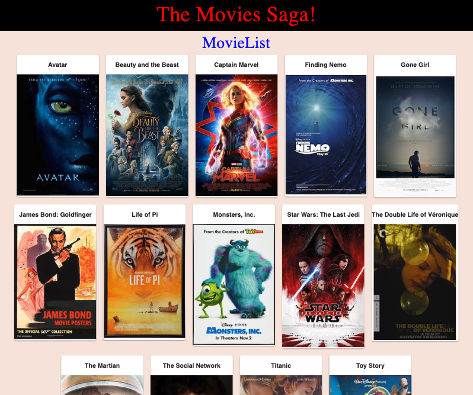
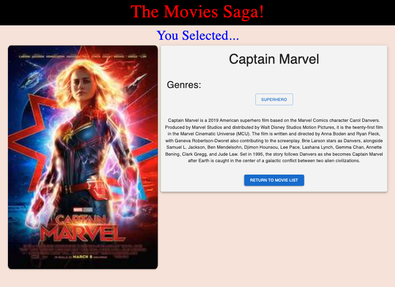

# Project Name
MOVIE SAGAS

## Description

Duration: Weekend Sprint

The focus of this project was to render a list of movies stored in a database and, upon clicking on a movie, bring up detailed information about that movie. Those details include the title, image, genres, and a written description. After viewing,  To do this React, Redux and Sagas were used call, gather and store the data in state which can then be called on the DOM. Material UI was used for styling the pages.

## Screenshots
Start Page

Details page

## PreRequisites
Node.js, React, React-Redux, Redux-Sagas, Material UI

## Installation
* Create a database named saga_movies_weekend.
* Run the queries from database.sql on the saga_movies_weekend database.
Run the following:
* npm install
* npm install @mui/material @emotion/react @emotion/styled
* npm run server to run the server on port 5001.
* npm run client to run the React app on port 5173.

## Built With
Node.js React Redux Saga Vite PostGreSQL Axios Express MaterialUI

## Acknowledgements
Prime Academy instructors and colleagues

